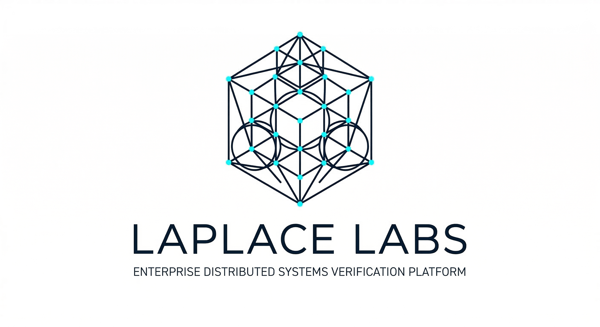
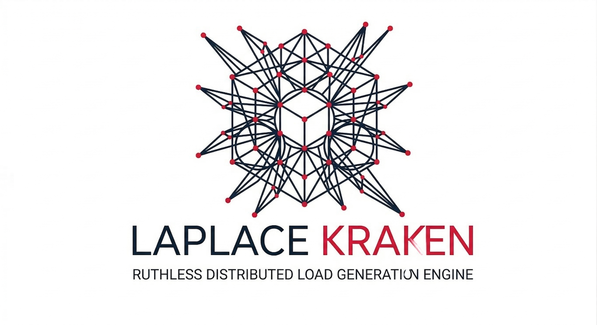
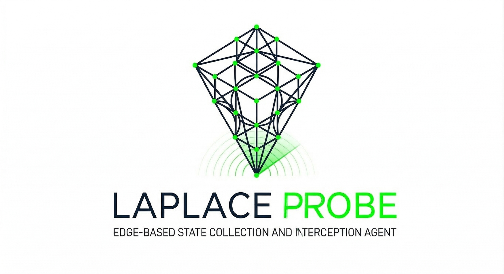

  

> **확률에 의존하지 않고 확정으로 승부하는 클라우드 네이티브 결정론적 검증 제국**

 

<table>
<tr>
<td align="center">
 
<b>Axiom</b>
</td>
<td align="center">
 
<b>Kraken</b>
</td>
<td align="center">
 
<b>Probe</b>
</td>
</tr>
</table>

 

-----

> *"우리는 방금, 분산 시스템이 스스로 죽어가는 순간을 낚아채는 데 성공했다."*

Laplace 제국은 엔터프라이즈 B2B 인프라의 붕괴를 사전에 예측하고 수학적으로 통제하는 클로즈드 소스(Closed-Source) 기반의 클라우드 네이티브 시스템입니다. 우리는 우연과 확률에 기대는 기존의 테스트 도구들을 경멸합니다. Laplace는 타겟 코드를 15KB의 Wasm 바이너리로 찌그러뜨리고, Firecracker MicroVM의 통제된 샌드박스 안에서 10만 개의 평행우주를 탐색하여 동시성 결함을 1나노초의 오차 없이 확정적으로 심판합니다.

-----

## ⚠️ Note: Read-only Mirror Repository

> This repository is a sanitized, read-only mirror of the internal **Laplace Monorepo**.
> To ensure maximum security and provide a perfectly clean state for our users, all internal development histories, experimental branches, and private modules are automatically stripped out by our CI/CD Gatekeeper prior to deployment.
>
> As a result, the commit history here is intentionally squashed into a single unified commit. For contributions, issue tracking, or detailed architectural history, please refer to our main ecosystem guidelines.

-----

## 🧭 The Imperial Navigation (통합 라우터)

**이 저장소 내부의 코드를 직접 읽고 해석하려 하지 마십시오.** 이곳에 남겨진 코드는 제국의 거대한 인프라를 지탱하는 그림자에 불과합니다. 프레임워크의 작동 원리, 아키텍처 철학, 그리고 클라우드 네이티브 통제권에 대한 모든 진실(Single Source of Truth)은 공식 문서 허브에 영구 박제되어 있습니다.

| 코어 엔진 | 역할 및 1줄 명세 | 공식 문서 (SSOT) |
| :--- | :--- | :--- |
| **Axiom** | Z3 솔버를 배제하고 Ki-DPOR + MCR 알고리즘으로 상태 공간 폭발을 억제하는 수학적 동치성 검증 엔진. | [Docs ↗](https://laplace-labs.com/concepts/axiom) |
| **Kraken** | Box-Muller 변환으로 난수를 통제하며 10만 명의 가상 유저(VU)와 카오스 폭격을 쏟아내는 부하 엔진. | [Docs ↗](https://laplace-labs.com/concepts/kraken) |
| **Probe** | 관측자 효과(Observer Effect)를 원천 차단하는 QUIC/eBPF 기반 초저지연 시맨틱 압축 통신망. | [Docs ↗](https://laplace-labs.com/concepts/probe) |
| **LKS** | 거대 레거시 코드베이스를 O(1) Index와 Graph로 해체하여 15KB 지식 알약으로 압축하는 Tri-Store 시스템. | [Docs ↗](https://laplace-labs.com/concepts/architecture.html) |
| **CLI** | `#[laplace::axiom_target]` 1줄의 매크로를 Wasm으로 번들링하여 클라우드에 록인(Lock-in)시키는 터미널 사령부. | [Docs ↗](https://laplace-labs.com/concepts/architecture.html) |

-----

## 📜 Sovereign Guard (제국의 율법)

이 코드베이스를 열람하거나 제국의 인프라에 기여하고자 하는 모든 엔지니어는 다음의 절대 규칙을 준수해야 합니다. **코드는 이 규칙을 위반할 권리가 없습니다.**

1.  **언어 불가지론적 Wasm 통제 (Wasm-Native Sovereignty):**
    제국에 제출되는 모든 도메인 로직은 언어에 종속되지 않는 샌드박스 격리를 위해 단일 Wasm 바이너리로 컴파일되어야 합니다. 호스트 I/O를 직접 호출하는 등 Wasm Import/Export 규약을 위반하는 역방향 참조는 엄격히 금지됩니다.
2.  **수학적 무결성 증명 (Mathematical Integrity Validation):**
    단순한 단위 테스트 커버리지는 인정하지 않습니다. 모든 코어 로직은 Bounded Model Checking(BMC) 및 Kani/TLA+ 증명을 통과하여 Zero-Deadlock과 Zero-Race Condition임을 수학적으로 증명해야 합니다.
3.  **단일 진실 공급원 준수 (SSOT Adherence):**
    코드는 철학을 구현한 결과물일 뿐입니다. 모든 기능의 추가와 변경은 반드시 `Laplace-Labs-Docs`의 아키텍처 명세서(Concepts/ADR) 개정을 선행해야 합니다. 문서에 명시되지 않은 코드는 존재하지 않는 것으로 간주합니다.

> ⚠️ **Warning:** 위 제국의 율법 중 단 하나라도 어긋날 경우, CI/CD 파이프라인의 Gatekeeper 정적 파서(`laplace-scribe`)가 해당 PR과 코드를 즉각적으로 파괴(Drop)하고 병합을 영구 거부합니다.

## 💼 Enterprise & Onboarding

Laplace 제국의 클라우드 네이티브 검증 인프라는 철저한 B2B 라이선스 기반으로 제공됩니다. 
6-Tier 과금 모델 및 온프레미스(Air-gapped) 설치, 전용 Firecracker 인스턴스 할당에 대한 논의는 아래 채널을 통해 진행됩니다.

- 📧 **도입 및 세일즈 문의:** `enterprise@laplace-labs.com`
- 🛡️ **보안 및 취약점 보고:** 제국의 인프라에서 보안 취약점을 발견한 경우, GitHub Issue가 아닌 `security@laplace-labs.com`으로 즉시 보고하십시오.

**Laplace Labs** — *Observe. Prove. Heal.*

`v0.8.0-beta-1` | Apache-2.0 | Built with Rust

